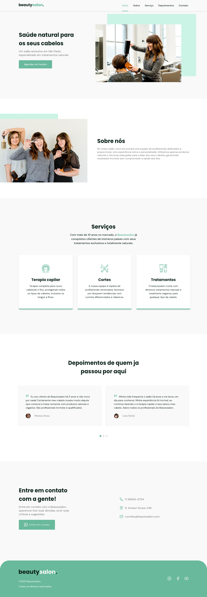

# ✨ Beautysalon Landing Page

Uma landing page moderna e responsiva desenvolvida para um salão de beleza fictício, focada em experiência do usuário, design elegante e navegação fluida.

---

## 🚀 Demonstração

> Projeto desenvolvido para estudos de front-end e construção de interfaces modernas.

## 📸 Preview

### Desktop



### Mobile

---

## 🛠️ Tecnologias Utilizadas

- **HTML5**
- **CSS3**
- **JavaScript Vanilla**
- **Bootstrap Icons**
- **Google Fonts**

---

## 🎨 Funcionalidades

✅ Layout moderno e elegante  
✅ Navegação suave entre seções  
✅ Menu com destaque automático durante o scroll  
✅ Cards interativos com efeitos hover  
✅ Design responsivo  
✅ Estrutura organizada e semântica  

---

## 📂 Estrutura do Projeto

```bash
📦 landing-page-salao
 ┣ 📂 assets
 ┃ ┣ 📂 css
 ┃ ┃ ┗ 📜 style.css
 ┃ ┣ 📂 js
 ┃ ┃ ┗ 📜 script.js
 ┃ ┗ 📂 images
 ┣ 📜 index.html
 ┗ 📜 README.md
```

---

## 🖥️ Seções da Landing Page

### 🏠 Home
Apresentação principal do salão com CTA para contato.

### 💇 Sobre
Descrição da proposta e filosofia do salão.

### ✂️ Serviços
Exibição dos principais serviços oferecidos.

### 💬 Depoimentos
Sessão com feedbacks de clientes.

### 📞 Contato
Informações de contato e botão de ação.

---

## 📱 Responsividade

O projeto foi desenvolvido com foco em adaptação para diferentes tamanhos de tela, proporcionando uma boa experiência tanto em desktops quanto em dispositivos móveis.

---

## 🎯 Objetivo do Projeto

Este projeto teve como objetivo praticar:

- Estruturação semântica com HTML
- Estilização moderna com CSS
- Interatividade com JavaScript
- Organização de projetos front-end
- Construção de interfaces profissionais

---

## 📚 Aprendizados

Durante o desenvolvimento foram praticados conceitos importantes como:

- Flexbox
- Responsividade
- Manipulação de DOM
- Scroll behavior
- Estados ativos em navegação
- Organização visual e UI

---

## ⚡ Como Executar o Projeto

```bash
# Clone o repositório
git clone https://github.com/seu-usuario/landing-page-salao.git

# Entre na pasta
cd landing-page-salao

# Abra o index.html no navegador
```

---

## 👨‍💻 Autor

Desenvolvido por Rodrigo 🚀

---

## 📄 Licença

Este projeto está sob a licença MIT.

